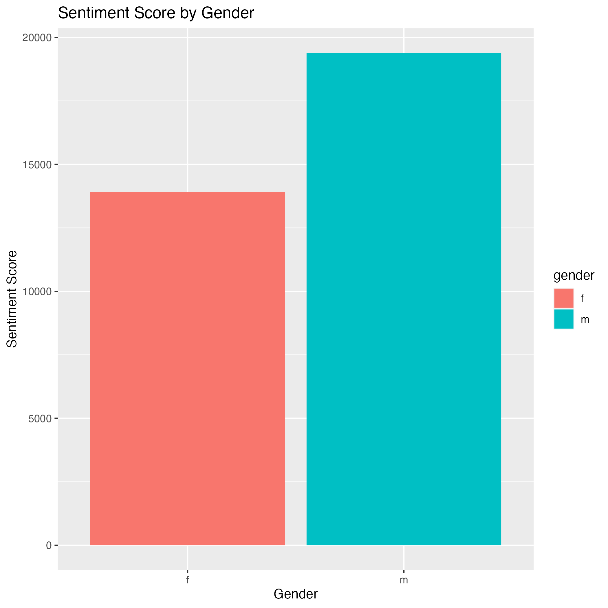

title: "Sentiment Analysis on Happy Moments"
author: "Your Name"
output: html_document
---

## Introduction

This analysis aims to explore the HappyDB dataset to understand what makes people happy. We will focus on the most frequently used words to express happiness among different genders.

```{r setup, include=FALSE}
knitr::opts_chunk$set(echo = TRUE)
library(tidyverse)
library(tidytext)
library(DT)
library(wordcloud2)
library(scales)
library(wordcloud2)
library(gridExtra)
library(ngram)
library(shiny) 


# call function lib
source("lib/analysis_functions.R")
```

```{r load data, warning=FALSE, message=FALSE}
hm_data <- read_csv("/Users/lizan/Documents/GitHub/52243project1R/output/processed_moments.csv")

urlfile<-'https://raw.githubusercontent.com/rit-public/HappyDB/master/happydb/data/demographic.csv'
demo_data <- read_csv(urlfile)
```

```{r combining data, warning=FALSE, message=FALSE}
# Combine both the data sets and keep the required columns for analysis
hm_data <- hm_data %>%
  inner_join(demo_data, by = "wid") %>%
  select(wid,
         original_hm,
         gender, 
         marital, 
         parenthood,
         reflection_period,
         age, 
         country, 
         ground_truth_category, 
         text) %>%
  mutate(count = sapply(hm_data$text, wordcount)) %>%
  filter(gender %in% c("m", "f")) %>%
  filter(marital %in% c("single", "married")) %>%
  filter(parenthood %in% c("n", "y")) %>%
  filter(reflection_period %in% c("24h", "3m")) %>%
  mutate(reflection_period = fct_recode(reflection_period, 
                                        months_3 = "3m", hours_24 = "24h"))
```


### calculate word count using function


```{r setup, include=FALSE}
my_word_count <- calculate_word_count(hm_data, "text")


```


# Create a bag of words using the text data

```{r combining data, warning=FALSE, message=FALSE}
bag_of_words <-  hm_data %>%
  unnest_tokens(word, text)

word_count <- bag_of_words %>%
  count(gender, word, sort = TRUE)
```


# visulize the result
```{r combining data, warning=FALSE, message=FALSE}
# Filter top 10 most frequent words
top_words <- word_count %>%
  group_by(gender) %>%
  top_n(10, wt = n)

# Visualize the result
ggplot(top_words, aes(x = reorder(word, n), y = n, fill = gender)) +
  geom_col() +
  coord_flip() +
  labs(title = "Most Frequently Used Words to Express Happiness Among Different Genders",
       x = "Words",
       y = "Frequency") +
  facet_wrap(~gender)


# separate data frames
male_words <- filter(top_words, gender == "m")
female_words <- filter(top_words, gender == "f")

```

```{r}
library(tidytext)

head(sentiments)


```


# 1. Sentiment Score by Gender
This bar chart aims to quantify the emotional tone behind the words used by different genders when expressing happiness.
It provides a sentiment score for each gender, calculated using the bing lexicon, allowing us to see whether men or women express happiness in a more positive or negative manner.

use the `bing` lexicon to calculate the sentiment score for each word and then aggregate them by gender.

```{r sentiment-score}
# Load the tidytext package
library(tidytext)

# Calculate sentiment score
sentiment_score <- bag_of_words %>%
  inner_join(sentiments, by = "word") %>%
  count(gender, sentiment) %>%
  spread(sentiment, n, fill = 0) %>%
  mutate(sentiment_score = positive - negative)

# Visualize the sentiment score by gender
fig_1 = ggplot(sentiment_score, aes(x = gender, y = sentiment_score, fill = gender)) +
  geom_col() +
  labs(title = "Sentiment Score by Gender",
       x = "Gender",
       y = "Sentiment Score")
fig_1
```
### export fig
```{r}

ggsave(filename = "figs/plot_1.png", plot = fig_1)
```




# 2. Network Graph of Bigrams
# create network graph to directly show witch pair of words are 
2. Network Graph of Bigrams
The network graph is used to visualize the relationships between pairs of words (bigrams) that frequently appear together in the dataset.
The graph helps to identify common phrases or combinations of words that people use to describe their happy moments, offering insights into the language of happiness.


```{r}


library(igraph)
library(ggraph)
library(tidyr)  

bigrams <- hm_data %>%
  unnest_tokens(bigram, text, token = "ngrams", n = 2)

# Count and filter to get top 50 bigrams
bigram_count <- bigrams %>%
  count(bigram, sort = TRUE) %>%
  head(100)

# clean
bigram_count <- bigram_count %>%
  drop_na(bigram)

bigram_network <- bigram_count %>%
  separate(bigram, c("word1", "word2"), sep = " ", remove = FALSE) %>%
  drop_na(word1, word2) %>%
  graph_from_data_frame()

# Visualize the network
fig_2 = ggraph(bigram_network, layout = "fr") +
  geom_edge_link(aes(edge_alpha = n), show.legend = FALSE) +
  geom_node_point(color = "blue", size = 5) +
  geom_node_text(aes(label = name), vjust = 1, hjust = 1) +
  theme_void()
fig_2
```

### export fig
```{r}

ggsave(filename = "figs/plot_2.png", plot = fig_2)

```

```{r}
combined_data <- inner_join(bag_of_words, hm_data, by = "wid")
```

```{r}
colnames(combined_data)

```

# 3.Top 5 Words by Gender and Marital Status (Frequency)
This graph aims to identify the most frequently used words to express happiness, segmented by both gender and marital status.
The graph displays the top 5 words for each group, allowing us to see if different life circumstances (like being married or single) influence the language used to express happiness.

```{r}
# rename
combined_data <- combined_data %>%
  rename(
    gender = gender.x,
    marital = marital.x
  )

word_count_gender_marital <- combined_data %>%
  count(gender, marital, word, sort = TRUE) %>%
  group_by(gender, marital) %>%
  top_n(5, wt = n)

# Visulize the Result
fig_3 =  ggplot(word_count_gender_marital, aes(x = reorder(word, n), y = n, fill = marital)) +
  geom_col() +
  coord_flip() +
  labs(title = "Top 5 Words Used to Express Happiness by Gender and Marital Status",
       x = "Words",
       y = "Frequency") +
  facet_grid(marital ~ gender)


```

### export fig
```{r}

ggsave(filename = "figs/plot_3.png", plot = fig_3)

```


# 4. Top 5 Words by Gender and Marital Status (Percentage)
Similar to the previous graph, but this one uses percentages instead of raw counts to account for the imbalance in the number of responses from each group.
The graph shows the top 5 words used to express happiness by each group, but normalized as a percentage of the total words used by that group. This provides a more balanced view across different genders and marital statuses.
```{r}
# Percentage
word_count_gender_marital <- combined_data %>%
  count(gender, marital, word, sort = TRUE) %>%
  group_by(gender, marital) %>%
  mutate(total = sum(n)) %>%
  top_n(5, wt = n) %>%
  ungroup() %>%
  mutate(percentage = n / total * 100)

# Visualize the Result
fig_4 = ggplot(word_count_gender_marital, aes(x = reorder(word, percentage), y = percentage, fill = marital)) +
  geom_col() +
  coord_flip() +
  labs(title = "Top 5 Words Used to Express Happiness by Gender and Marital Status",
       x = "Words",
       y = "Percentage (%)") +
  facet_grid(marital ~ gender)

```

### export fig
```{r}

ggsave(filename = "figs/plot_4.png", plot = fig_4)

```


```{r}

```


```{r}
```


```{r}
facet_grid(marital ~ gender)